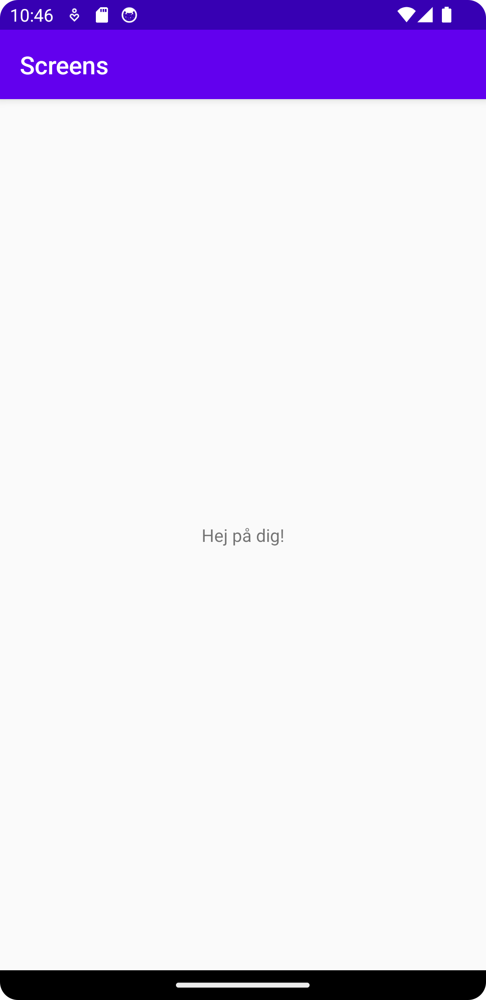

# Rapport

Veckans uppgift handlade om att använda intents för att ändra activity

## MainActivity

I MainActivity skapade jag en function som har det inte så bra namnet av MainAc2() (Har svårt att hitta på ett bättre namn)
I den funktionen hämtar jag knappen på MainActivity med hjälp av Id.
Efter det lägger jag en onClickListener på knappen som hanterar Intents för att byta Activity till ActivityTwo
Jag lägger even till en extra med medelandet "Hej på dig!"
```
    protected void onCreate(Bundle savedInstanceState) {
        ...
        mainAc2();
    }
    private void mainAc2(){
        Button click = (Button) findViewById(R.id.button);
        click.setOnClickListener(new View.OnClickListener() {
            @Override
            public void onClick(View view) {
                Intent intent = new Intent(MainActivity.this, ActivityTwo.class);
                intent.putExtra("msg", "Hej på dig!");
                startActivity(intent);
            }
        });
    }
```

## ActivityTwo

I ActivityTwo så hämtar jag ut Extra attibut ifrån Intenten
Kollar ifall det finns någon data i bundlen (Det som extras ligger som)
Finns det något så lägger jag in medelandet som sickades från ActivityMain i TextViewen.
```
    protected void onCreate(Bundle savedInstanceState) {
    ...
        Bundle extras = getIntent().getExtras();
        if (extras != null) {
            String msg = extras.getString("msg");
            TextView text = (TextView) findViewById(R.id.msg);
            text.setText(msg);
        }
    }
```

## Screenshots
### Screenshot av ActivityMain

### Screenshot av ActivityTwo

